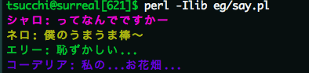


全国1億3千万人のミルキアンの皆様、お待たせいたしました。[Acme::MilkyHolmes](http://search.cpan.org/dist/Acme-MilkyHolmes)をリリースしました。

こんな感じのモジュールです。

### members()メソッド
+ ミルキィホームズのメンバーが取得できて便利

```perl
use Acme::MilkyHolmes;
my ($sherlock, $nero, $elly, $cordelia) = Acme::MilkyHolmes->members();

```

### キャラクター毎のインスタンス
+ 各キャラクター(ここではシャロ)の色々な情報が取れて便利

```perl
my $sherlock = Acme::MilkyHolmes::Character::SherlockShellingford->new();
$sherlock->name; # => 'シャーロック・シェリンフォード'
$sherlock->nickname; # => 'シャロ'
$sherlock->birthday; # => '3/31'
$sherlock->voiced_by; # => '三森 すずこ'
$sherlock->toys; # => 'サイコキネシス'
```

### say()メソッド
+ いつもの小芝居ができて便利

```perl
my ($sherlock, $nero, $elly, $cordelia) = Acme::MilkyHolmes->members();
$sherlock->say('ってなんでですかー');
$nero->say('僕のうまうま棒〜');
$elly->say('恥ずかしい...');
$cordelia->say('私の...お花畑...');
```

実行すると、色がついてこんな感じになります。




とか大体こんな感じです。

以前、[Yokohama.pm](http://tsucchi.github.io/perl/2014/05/25/yokohamapm)で紹介した
スライド[最高のテストデータの話](http://tsucchi.github.io/slides/yokohamapm/11)もあわせて見ていただければ、と思います。

### リポジトリ

+ [https://github.com/tsucchi/p5-Acme-MilkyHolmes](https://github.com/tsucchi/p5-Acme-MilkyHolmes)

issue とか p-r とかはコチラにどうぞ。


### 最後に

こちら(↓)の記事によりますと、

[第一回ももクロハッカソンに参加して Acme::MomoiroClover リリースしました - 2nd life](http://secondlife.hatenablog.jp/entry/20110904/1315129581)

```
何故今更 Acme::MomoiroClover を作ったかと云うと、今までに日本のアイドルの Acme シリーズは二つ、Acme::MorningMusume と Acme::AKB48 があります。その Acme が存在するアイドル2ユニットに共通していえることの一つに、どちらも紅白歌合戦に参加したことがあることが言えます。つまるところ、日本の Acme::アイドル が作られたのユニットは100%紅白出場しているため、ももクロちゃんの今の目標である紅白歌合戦出場をほんの少しでもサポートできたらと思い、験担ぎの意味を込めて作りました！！
```

との事で、ももクロも紅白出場しましたね。ミルキィホームズはアイドルじゃない(「声優ユニット」とされており、本人達も大抵「ユニット」という呼称を使っています)のですが、これを契機に(?)紅白出場してくれたら最高だなぁ、と思います。

