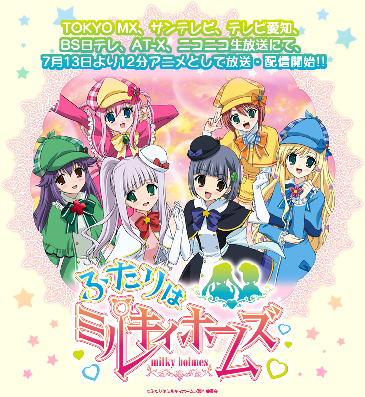

自己紹介とか
==========

<address>[@tsucchi](http://twitter.com/tsucchi)</address>
はちぴー初参加です。よろしくです

自己紹介
---
+ 土田　拓也(つちだ　たくや)
+ [@tsucchi](http://twitter.com/tsucchi) とか [blog(http://tsucchi.github.io/)](http://tsucchi.github.io/)とか
+ 普段は Perl とか SQL とか書いてます
+  こんなかんじのアイコンです
  + ちなみにこれ、恵比寿でピアノ弾いてるとこです
  + 近影っぽく見えるけど、実は5年くらい前の写真...

好きなもの
---
+ `Perl` とか`ミルキィホームズ`とか
+ DB はお仕事で一生懸命使ってるけど、あんま好きじゃないです
+ ORM 作ったり、使ったり、いじったりするのは好きかも




で、今回のテーマについて
---
+ コールバックですよね！

JS ほとんど書かないから、使った事無い！以上！
---

いや、あった
---
+ twitter 上で、ミルキィホームズに関連したつぶやきを、perlism みたいに集めるやつ作ろうとしてた
+ AnyEvent::Twitter::Stream 使ってました。アレ、コールバックですよね！
+ tweet の limit をすぐ超えちゃうし、動かしてみたらコレじゃない感出てきたので、今は止めてます...


僕が本当に欲しかったもの。それは...
---

twitter を検索したい！
---

検索画面あるじゃん？
---

通常の検索だとダメなんです！
---

通常の検索だとダメな点
---
+ #milkyholmes(ミルキィホームズのハッシュタグ)で検索するとすぐ分かるのですが...
    + `アフィリエイトつきリンク`とか...
    + `定期ポスト`とか...
        + 「ミルキィとか好きです！フォローよろ」って言うなら、アニメの感想とか tweet してよ...
        + 定期投げてる人に限って、そういうの無いんですよ...
+ そういうのウザいので、見たく無い！		


解決策1) vs アフィリエイト
---
+ それっぽいリンクを含む tweet を避ければ良い

```perl
(
  'amazon.co.jp',
  'amzn.to',
  'books.rakuten.co.jp',
  ...
)
```

解決策2) vs 定期ポスト
---
+ それっぽいクライアントを避ければ良い
  + 最近 Web 画面だとクライアント見えなくなってるけど、API なら見える

```perl
(
  'twittbot.net',
  'twiroboJP',
  'makebot.sh',
  ...
)
```

で、作ってみた...
---

と言いたいところなのですが...
---

すいません、最近「艦これ」にハマってたので、作ってません！
---


+ ちなみに秘書艦は`文月`、お気に入りは`那珂`ちゃんです！

まあそのうち作ると思います
---


おしまい
===
