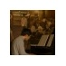

最近の話(ほぼポエム)
==========

<address>[@tsucchi](http://twitter.com/tsucchi)</address>

自己紹介
---
+ 土田　拓也(つちだ　たくや)
+ [@tsucchi](http://twitter.com/tsucchi) とか [blog(http://tsucchi.github.io/)](http://tsucchi.github.io/)とか
+ 普段は Perl とか SQL とか書いてます
+  こんなかんじのアイコンです
+ `Perl` と `ミルキィホームズ`が好きです
    + [探偵歌劇ミルキィホームズTD](http://milky-holmes-anime.com/)が放送終了で悲しい難民です
    + [みるみるミルキィ](http://milky-holmes.com/unit/mirumiru/)は好評放送中なので、見ましょう！
    + 挿入歌CD「Treasure Disc」が好評発売中なので、買うと良いです
	+ 9/9 に新曲とライブBD がでるらしいぞ！

<iframe src="http://rcm-fe.amazon-adsystem.com/e/cm?t=tsucchisblog-22&o=9&p=8&l=as1&asins=B00T1WXA00&ref=qf_sp_asin_til&fc1=000000&IS2=1&lt1=_blank&m=amazon&lc1=0000FF&bc1=000000&bg1=FFFFFF&f=ifr" style="width:120px;height:240px;" scrolling="no" marginwidth="0" marginheight="0" frameborder="0"></iframe>

どうでもいいやつ
---
+ 最近、`teito.yokohama`(偵都ヨコハマ)というドメインをとりました
+ これで milkyholmes@teito.yokohama っていう面白メールアドレスが使えて最高だ(まだメル鯖設定してませんが)

最近考えてること
---
+ よくある話だとおもうのだけど...

レガシーアプリケーションについて
---
+ 年代モノは、まあいろいろひどい
+ ひどさは色々あるけど、簡略化すると結局は「コードの汚さ」と「設計のまずさ」にいきつく
+ と、いうわけで...

リファクタリングしたい
---

リファクタリング?
---

リファクタリング?
---
+ いろいろひどいので、リファクタリングしたい
+ でも、何をもって「よくなった」とすればよい？

いろいろ考えた
---
+ 自分がどういうコードをきれいと考えてるか、とか
+ 社内でブレストしてみたりとか...

結局ベタな結論にたどりつく
---

そのベタな結論
---
+ リファクタリングの前後でこれらの指標がよくなればいいのでは？というやつ
    + 複雑度
    + 行数
    + カバレッジ

あるといいかも的なやつ
---
+ 類似度(コピペの検出)
+ クラス間の依存度
    + これはホントはめっちゃ欲しいのだけど、とるのが大変そうなので、優先度下げ気味になった
+ [bugspots のスコア](http://shanon-tech.blogspot.jp/2015/02/google-bugspots.html)
    + コミットログを見るので、ルールの整備が必要
    + 長期的に見ないと意味ないので、リファクタリング後しばらくたってから見る必要がある

結論ではないけど、結論っぽいなにか
---
このへんの指標を pull request フックで表示したり、プロジェクトの前後で見れるようにするといいかも的なことを今考えてます。いくつかは OSS としてフィードバックできるかも。

おしまい
===

