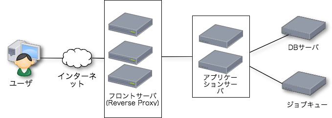

今までの(名状しがたい)ジョブキュー(のようなもの)と、これからのジョブキュー
---

[@tsucchi](http://twitter.com/tsucchi)


自己紹介
---
+ 土田　拓也(つちだ　たくや)
+ [@tsucchi](http://twitter.com/tsucchi) とか [blog(http://tsucchi.github.io/)](http://tsucchi.github.io/)とか
    +  こんなかんじのアイコンです
    + `Perl` と `ミルキィホームズ`が好きです

+ [株式会社シャノン](http://shanon-tech.blogspot.jp/)というところで、エンジニアやってます
    + Perl とか SQL とか書いたり
	+ パフォーマンスとかセキュリティのこと考えたり
    + たまにスクラムっぽいことやってたり、そんな感じ

今回のテーマ
---
+ 「今までと、これから」

今回のテーマ
---
+ ちょうど最近ジョブキューの移行やってたので、ぴったりだ(応募)

<blockquote class="twitter-tweet" data-lang="ja"><p lang="ja" dir="ltr">枠がまだあるなら何か話したいです！</p>&mdash; tsucchi (@tsucchi) <a href="https://twitter.com/tsucchi/status/902897087511052288?ref_src=twsrc%5Etfw">2017年8月30日</a></blockquote>
<script async src="//platform.twitter.com/widgets.js" charset="utf-8"></script>

今回のテーマ
---
+ 「今までと、これから」

今回のテーマ
---
+ 「今までのジョブキューとこれからのジョブキュー(？)」

ちょっと待て
---

今回のテーマ
---
+ 社内のあれ、ジョブキューと呼べる代物か(?！)

今回のテーマ
---
+ 「今までの(`名状しがたい`)ジョブキュー(`のようなもの`)と、これからのジョブキュー」

名状しがたいジョブキューのようなもの
---
+ かつて存在した、`「謎のジョブキュー的な何か」`について紹介します
+ これは考古学と、そこから得られる反省の話

アプリケーションとジョブキューについて
---
+ 普通の Web アプリケーションはこんな感じ



なぜジョブキューが必要なのか
--
+ [なぜジョブキューを使うのか - 第10回　ジョブキューで後回し大作戦―TheSchwartz，Qudo，Q4M（1） - Perl Hackers Hub](http://gihyo.jp/dev/serial/01/perl-hackers-hub/001001)

```
ジョブキューを使う主な理由は，Webアプリケーションで処理するには重く，リアルタイム性が必要ない処理をWebのサイクルから切り離して処理を行うためです。Webアプリケーションとは物理的にサーバを分けることも可能となるので，サービスが大きくなったときなどにスケールアウトさせやすくなります。
```

なぜジョブキューが必要なのか
--
+ Webの1リクエストにやるには、ちょっと重い処理はジョブキューに回すのが良くあるやり方
+ 典型的にはメール送信とか
+ Perl だと TheSchwartz とか Qudo とか使います

今までのジョブキュー
--
+ 普通はこういう感じなのですが


今までのジョブキュー
--
+ なんかこんな感じになってた


名状しがたいやつ1号
---


+  2006年くらいからあるやつ
    + TheSchwartz も2007年ごろみたいなので、微妙っちゃ微妙
+ 指定時間になると、指定されたURLを叩く物体
+ API もあって、API でジョブ登録できるので、当時としては割と先進的だったのかも

名状しがたいやつ2号
---


+ 2010年ごろからあるやつ
+ DB バックエンドの独自実装で、即時実行で指定された URL を叩く物体
+ 1号と2号は合体できなかったのですかね。。。(困惑)

名状しがたいやつ3号
---


+ 2012年ごろからあるやつ
+ Gearman をバックエンドにした割と普通っぽいやつ

名状しがたいやつ3号
---


+ 2012年ごろからあるやつ
+ Gearman をバックエンドにした割と普通っぽいやつ
    + なのだが、(なぜか) Gearman から溢れた場合を想定していて、その場合は TheSchwartz に流す
	    + 何がしたいのか、正直良くわからない
    + 時間指定もできて、その場合は TheSchwartz に流す
	    + 何がしたいのか、正直良くわからない

名状しがたいやつ3号
---


+ TheSchwartz (みたいな普通のジョブキュー)があれば全部やりたいことできたのでは？

なんかこういうの見たことある
---


とてもつらい...
---
+ どこで何が動いてるのか良くわからない


どうしてこうなった...
---

どうしてこうなった...
---
+ (当時でも)TheSchwartz (みたいな普通のジョブキュー)があれば全部やりたいことできたのでは？

どうしてこうなった...
---
+ TheSchwartz のメモリリークの話
    + [TheSchwartz を PostgreSQL / SQLite で使うと worker プロセスが太る(のは解決済) - 酒日記 はてな支店
](http://sfujiwara.hatenablog.com/entry/20080626/1214474049)

どうしてこうなった...
---
+ メモリリークを追いきれなかったのかな？
    + このメモリリークは僕も踏んで、DBD::Pg のアップグレードをやった
+ ワーカーの作りにもよるけど、TheSchwartz のワーカー結構メモリ使うので、そのせいかも


これからのジョブキュー
---
+ <del>顧客</del>僕らが本当に求めていたもの


僕らが本当に求めていたもの
---
+ 「普通の」ジョブキュー
    + 時間指定ができて
	+ 良くわからないことしない
	    + (必要ないのに) HTTP 叩くとかしない
		+ (必要ないのに) Schwartz と Gearman を併用するとかしない
	+ 普通にワーカーとして動くもの

ジョブキュー
---
+ [Minion](http://search.cpan.org/~sri/Minion-7.07/lib/Minion.pm) の採用
    + 時間指定ができて
	+ 普通に使えて
	+ ちゃんとメンテされてる

移行について
---
+ データ移行などが少し大変だったけど、移行自体はスムーズに終わった


移行してわかったこと / よかったこと
---
+ 謎の仕組みを卒業できたのはよかった
    + `名状しがたい奴ら`がいなくなった
	    + 「普通のWebアプリのアーキテクチャ」になった
    + 非同期処理を入れやすくなった
    + 特に時間指定のジョブが実装しやすくなった

当たり前のことがのことが、当たり前にできるようになった

移行してわかったこと / 困ったこと
---
+ 結構データベースの CPU を食う
    + 割ときっちりロックかけるため
	+ PostgreSQL の新しい機能を上手く使ってる
+ PostgreSQL の話を少し

Minion で使ってる PostgreSQL の機能(1)
---
+ [SKIP LOCKED](https://wiki.postgresql.org/wiki/What%27s_new_in_PostgreSQL_9.5#SKIP_LOCKED)(>=9.5)
    + ロックしている行は飛ばして、ロックされてない次のレコードを取ってきて、ロック
		 + 「余計な行をロックせず」
		 + 「取りたい行だけロックしながら取る」
		 + まさにジョブキューのためにあるような機能
	+ [この辺](https://github.com/kraih/minion/blob/master/lib/Minion/Backend/Pg.pm#L242-L256)
         + `UPDATE ... RETURNING` も使ってる

で、これが重い...
---
+ とはいえ、ちゃんとロックかけて、上から順に欲しいレコードを取ってくれるのはありがたい


Minion で使ってる PostgreSQL の機能(2)
---
+ [NOTIFY](https://www.postgresql.jp/document/9.6/html/sql-notify.html)
    + PUBSUB っぽいことができる
	+ 結構前からあるらしい(>=9.0)
    + ジョブの INSERT 時に `minion.job` というイベントを PUBLISH
	    + [発信側](https://github.com/kraih/minion/blob/master/lib/Minion/Backend/Pg.pm#L922)
	+ ワーカー側は Mojo のイベントループで待機しているが、イベントを受信すると待機をやめてジョブを実行
        + [受信側](https://github.com/kraih/minion/blob/master/lib/Minion/Backend/Pg.pm#L26)

よくできてる
---
+ ジョブがないときは sleep しつつ、ジョブがあるときはすぐに実行してくれる

以上、ポスグレの話
---

まとめの前に...
---

レガシー、もしくは名状しがたいものについて
---
+ 歴史的経緯でひどい仕組みが出来上がってしまうのは、多分良くあること
+ ひどい仕組みでも、過去・現在の僕たちの給料の源泉になっていたのは事実
+ 敬意を持って異界に送って、未来を戦えるアーキテクチャを作るのが大事

まとめ
---
+ 謎のジョブキューを Minion に移行した
    + 普通に非同期処理ができる、普通の環境になってよかった
    + PostgreSQL の新しい機能とか独自機能とか使ってて、結構面白い
+ 違法改築みたいな事はしない
    + ちゃんと調査して、こじらせる前に直すのが大事

おしまい
===

おしまい
===

おまけにできればよかったやつ
---

時間があればと思って考えてたネタだけど、無理でしたごめんなさい
---

WebUIの話
---

マルチテナントの問題
---

その他
---

他にもいくつかネタはあるのだけど、時間とかいろいろな問題で割愛。すまぬ。Minion とか Mojolicious とか SRI が作ってるプロダクト、他の Perl とだいぶ文明が違ってて面白かったのだけど、うまく言語化する時間がありませんでした。本当にごめんなさい。

おしまい
===


